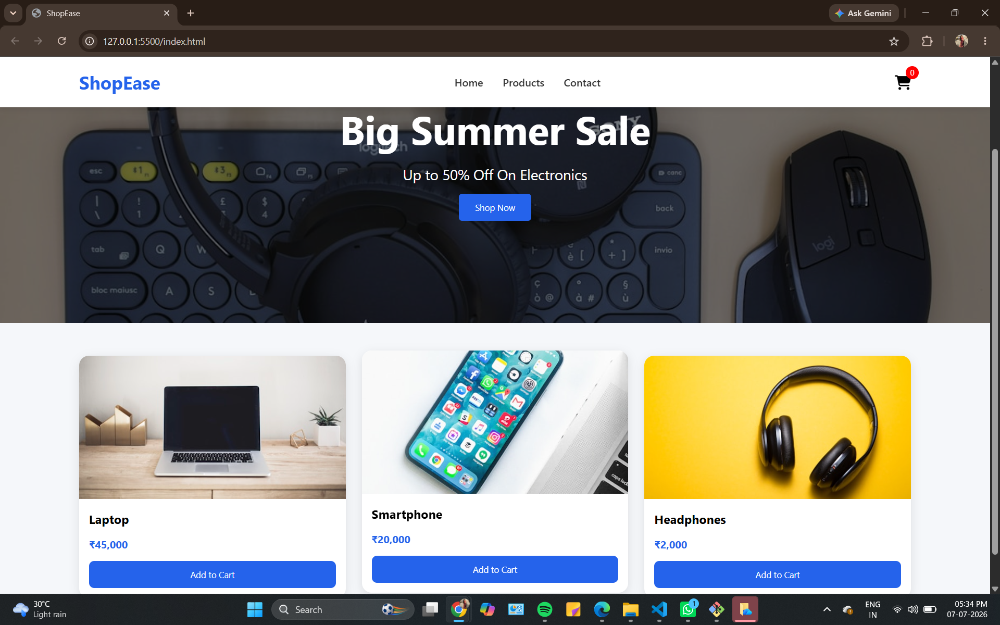
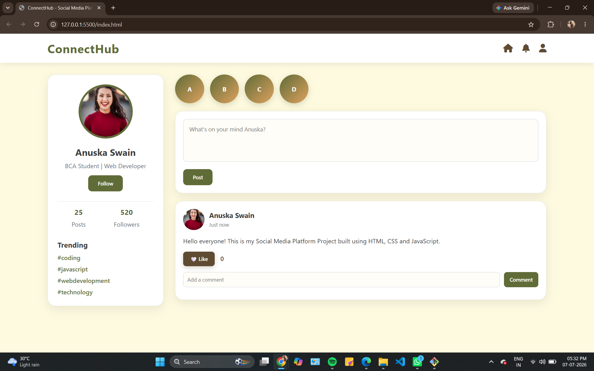

# 🚀 CodeAlpha Web Development Projects

<p align="center">
  <strong>Collection of projects completed during the CodeAlpha Web Development Internship</strong>
</p>

<p align="center">


</p>

---

# 👋 Welcome

This repository contains the web development projects I completed during my **CodeAlpha Web Development Internship**.

Each project demonstrates different front-end development concepts, responsive UI design, and JavaScript interactivity.

---

# 📂 Projects Included

## 🛒 1. E-Commerce Store

### Features

- Product Listings
- Shopping Cart
- Product Details
- Login & Registration UI
- Responsive Design

### 📸 Preview

<p align="center">



</p>

---

## 🌿 2. Social Media Platform

### Features

- User Profile
- Posts
- Comments
- Like System
- Follow System
- Premium Earthy Theme
- Responsive Layout

### 📸 Preview

<p align="center">



</p>

---

# 🛠 Technologies Used

| Technology | Purpose |
|------------|---------|
| HTML5 | Website Structure |
| CSS3 | Styling & Responsive Design |
| JavaScript | Interactive Features |
| Git | Version Control |
| GitHub | Project Hosting |

---

# 📁 Repository Structure

```text
CodeAlpha-Projects
│
├── ecommerce-store
│
├── social media app
│
├── screenshot.png
│
├── screenshot_1.png
│
└── README.md
```

---

# 🚀 How to Run

1. Download or clone this repository.

2. Open either project folder.

3. Open `index.html` in your web browser.

---

# 🎯 Internship Learning Outcomes

✅ Responsive Web Design

✅ JavaScript Fundamentals

✅ DOM Manipulation

✅ UI/UX Design

✅ Git & GitHub Workflow

---

# 📌 Future Enhancements

- Backend Integration
- Database Support
- Authentication
- Payment Gateway
- Real-time Messaging
- Notifications

---

# 👩‍💻 About Me

## **Anuska Swain**

🎓 BCA Student

💻 Passionate about Web Development

🌱 Currently learning Full Stack Development

---

<p align="center">

⭐ Thank you for visiting my repository!

If you found these projects interesting, consider giving the repository a ⭐.

Made with ❤️ by **Anuska Swain**

</p>
